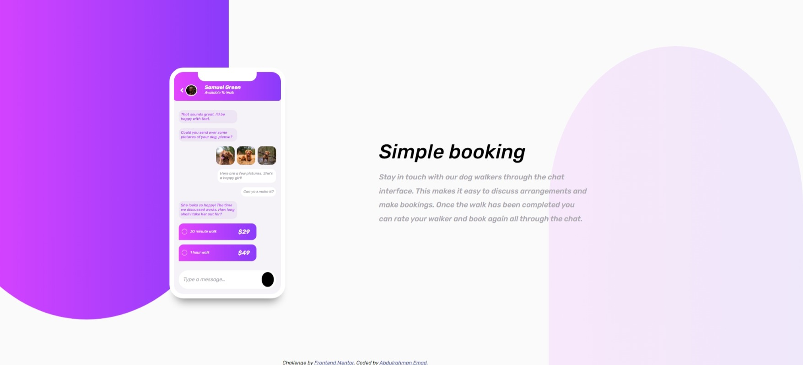
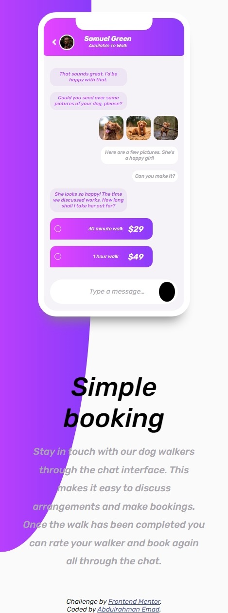

# Frontend Mentor - Chat app CSS illustration solution

This is a solution to the [Chat app CSS illustration challenge on Frontend Mentor](https://www.frontendmentor.io/challenges/chat-app-css-illustration-O5auMkFqY).

## Table of contents

- [Overview](#overview)
  - [The challenge](#the-challenge)
  - [Screenshot](#screenshot)
  - [Links](#links)
- [My process](#my-process)
  - [Built with](#built-with)
  - [What I learned](#what-i-learned)
  - [Continued development](#continued-development)
  - [Useful resources](#useful-resources)
- [Author](#author)

## Overview

### The challenge

I should be able to:

- View the optimal layout for the component depending on their device's screen size
- **Bonus**: See the chat interface animate on the initial load

### Screenshot

### Links

- Live Site URL: [live Site here](https://3omeed.github.io/chat-app-illustration-master/)

## My process

### Built with

- Semantic HTML5 markup
- CSS custom properties
- Flexbox
- Mobile-first workflow
- [Styled Components](https://styled-components.com/) - For styles

### What I learned

I learned keeping on practice my CSS and HTML, this was my first intermediate challenge in my life, it was hard actually
the best part is the chat interface and how to make it responsive for small screens.

### Continued development

I want in the future to add JS code to this project to make it more dynamic and also want to add animation to the chat interface.
don't hesitate to leave your feedback and your comment on my project helping me improve its code.

### Useful resources

- [MDN](https://developer.mozilla.org/en-US/)
- [W3SCHOOLS](https://www.w3schools.com/) - This is an amazing article which helped me finally understand XYZ. I'd recommend it to anyone still learning this concept.

## Author

- Website - [Abdelrahman Emad](https://www.linkedin.com/in/abdelrahman-emad-57bb10237/)
- Frontend Mentor - [@3omeed](https://www.frontendmentor.io/profile/3omeed)
